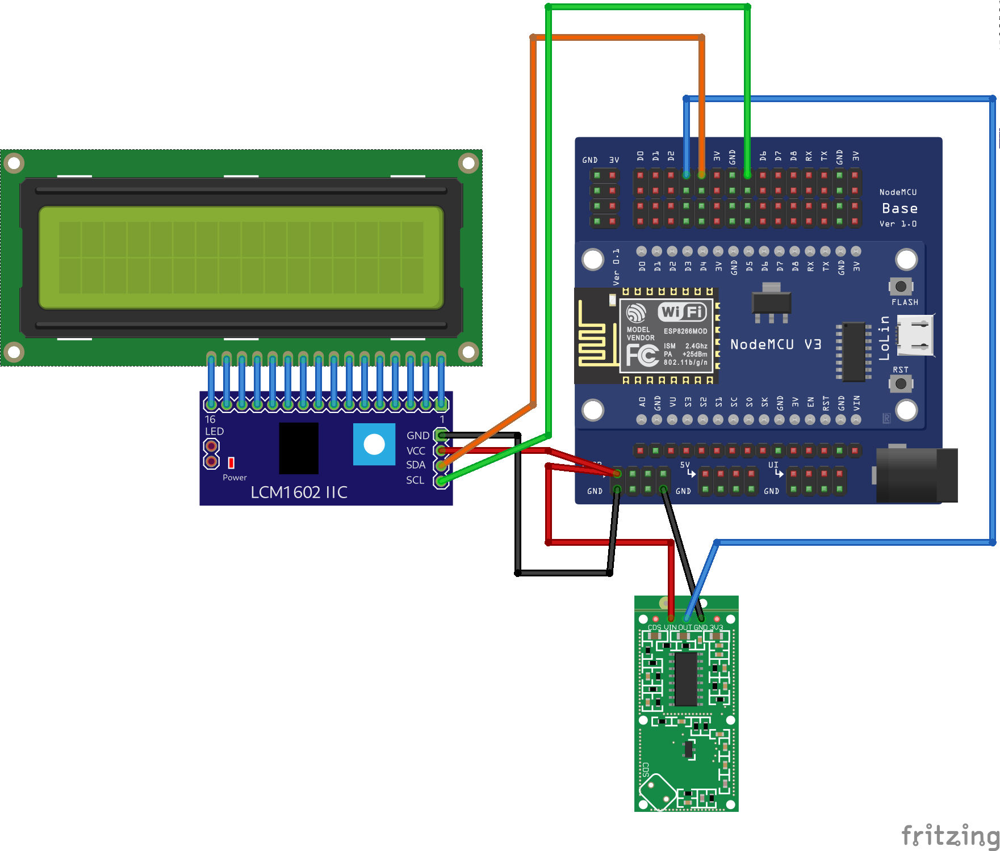
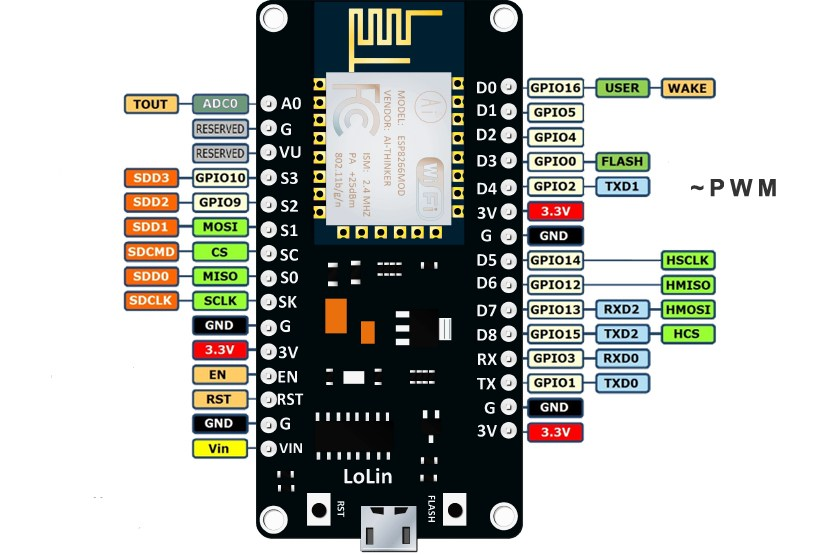

# Engineering Innovations project for HBHS
## Hunter Ruebsamen (HBHS)

Recently, my Grandmother’s office has been repeatedly broken into. While there are cameras in the building, the thieves are wearing masks. Identification is essentially impossible. In  Addition, the cameras only tell us what’s happened after we’ve been robbed. As such, the thought of making a motion sensor crossed my mind. It should be able to detect movement 15-20 feet in front of it, sound an alarm and display a message if this is the case.

**Parts List**
1. Lolin Node MCU v3 (ESP8266)
2. Lolin Node MCU Expansion Board
3. RCWL-0516 Doppler Radar Sensor
4. 1602 LCD i2c interface board
5. 16x2 LCD Display

